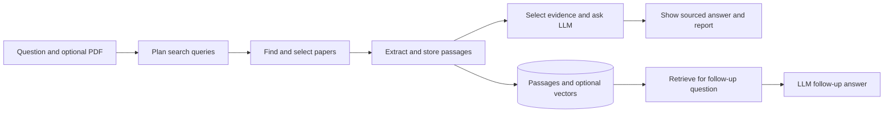

# ResearchOS: workflow, technology, and RAG

This guide describes what the current code does. It is written for explaining the project to teachers, including the parts that are rule-based and the parts that use AI.

## The short explanation

ResearchOS is an AI-assisted research workspace. A user asks a question and may upload a PDF. The app finds a small set of papers, extracts source passages, and gives selected passages to a language model so it can write an answer with links back to the evidence. The model is **not trained or fine-tuned on these papers**; the passages are supplied when an answer is requested.

**The search keywords are not generated by an LLM.** Python rules extract meaningful terms from the question and create up to three search queries. The LLM is normally called later, when the app has selected passages and needs to write a summary.

## What happens after “Let’s explore”

1. The React frontend creates a project containing the full question. If the user attached a PDF, it uploads that file. It then asks the FastAPI backend to start a `research` job.
2. A background worker takes the queued job. LangGraph runs a fixed sequence: `plan → discover → index → analyze → report`.
3. The worker stores progress events and results in the database. While it runs, the browser requests the latest project and job state about every 1.5 seconds and updates the five-step display.
4. The finished project contains its selected papers, source passages, AI answer, findings, and a formatted Markdown report.

This is a **predefined workflow**, not an autonomous agent that invents its own steps or chooses arbitrary tools.

## The five stages in the interface

| Stage | What actually happens | AI or external service? |
| --- | --- | --- |
| **Make a plan** | Remove common words, normalize terms, and form up to three search queries from the question. | Python rules; no LLM. |
| **Find papers** | Search arXiv, remove duplicate titles, score title and abstract relevance, and automatically select up to six papers. An uploaded corpus is used instead of arXiv search. | arXiv API; DataCite can provide arXiv records if arXiv search fails. No LLM. |
| **Read & collect** | Download or read the selected PDFs, extract text page by page, split it into passages, and store each passage with its source and location. Optionally create embeddings. | PDF parser; optional embedding API. No chat-model summary yet. |
| **Connect ideas** | Send selected passages and the full question to the LLM for a direct answer and supporting findings. Inspect limitation and conclusion excerpts in a second call for cited questions worth investigating. | Normally two chat-model calls, although provider retries/fallbacks can make more attempts. |
| **Your answer** | Format the saved answer, findings, source references, methodology, and limitations as a report. | No additional LLM call. |

### 1. Make a plan: keyword generation

`search_queries()` is a deterministic Python function. It takes up to eight meaningful normalized terms from the question, uses up to four for the focused query, and creates a broader query from the first one or two terms. For a question containing an explanatory word such as “how” or “why,” it may also add `survey` to one query to seek overview papers.

For example, **“How do neural networks classify images?”** can produce:

1. `neural networks classify images survey`
2. `neural networks classify images`
3. `neural networks`

These are **up to three separate query strings**, not three words and not three LLM prompts. The arXiv search converts terms within each string into an `AND` query. The full original question is kept for later evidence selection and answer generation. This planning step is useful but simple; it does not understand the research field deeply or design a systematic search protocol.

### 2. Find papers: discovery and selection

The app sends each generated query to arXiv and collects paper metadata: title, authors, year, abstract, paper URL, and PDF URL. It deduplicates results by normalized title. A relevance heuristic checks how much of the question appears in the title and abstract, gives weight to the main topic appearing in the title, and can favor survey or review papers for explanatory questions. The automatic workflow selects at most six candidates. If the user uploaded papers, it uses that supplied corpus and skips arXiv discovery.

Finding a paper here means **finding a candidate and its metadata**. It does not mean the full PDF has already been read.

### 3. Read & collect: build the source corpus

For each selected paper, the app downloads its PDF or reads the uploaded file. `pypdf` extracts text page by page. The parser recognizes some section headings and divides extracted text into passages of roughly 1,800 characters. The database stores each passage with its paper ID, page number, section, and text. If embeddings are enabled and the embedding provider is available, it also stores a vector for each passage; requests are batched in groups of 32 passages.

PDF bytes are discarded after extraction. Passages, vectors, and paper metadata are temporary working data for the open conversation. Closing it or reaching the one-hour inactivity limit removes that data after any running job finishes. Saved history contains only the question, result Markdown, and conversation text; it cannot resume retrieval. If an arXiv PDF cannot be read but its abstract is long enough, the app can index the abstract as a fallback. Scanned PDFs require OCR before this pipeline can use them.

### 4. Connect ideas: answer from selected evidence

The initial report currently selects **at most two passages per indexed paper**: an abstract when available and another passage ranked mainly by keyword overlap with the full question, section type, and page order. It sends the first 700 characters of each selected passage to the LLM, along with the full question and passage IDs. With six papers, this is at most twelve excerpts, not six complete PDFs.

The prompt asks for a coherent 3–5 sentence answer and up to four supporting points. The model returns structured JSON with source IDs. The application maps those IDs to real stored passages and displays source links. Claims are marked `needs_review`: a source link identifies the passage used, but it does **not** prove the interpretation is scientifically correct. If synthesis fails, the app reports the failure and can show source evidence rather than inventing an answer.

### 5. Your answer: report assembly

The final step takes the analysis already stored in the database and formats a Markdown report with a direct answer, findings, search methodology, limitations, and references. It does not ask the LLM to write the answer again.

## Where RAG is used

**RAG means Retrieval-Augmented Generation.** The system first retrieves information from an external knowledge source, then adds that information to the LLM prompt before generation. In ResearchOS, the external knowledge source is the collection of selected paper passages.

| RAG component | ResearchOS implementation |
| --- | --- |
| **Knowledge base** | Extracted PDF or abstract passages stored with paper/page metadata. |
| **Indexing** | Split text into passages; optionally store an embedding vector for each passage. |
| **Retrieval** | Select relevant stored passages for the full question or a follow-up question. |
| **Augmentation** | Put the selected passages, IDs, and question into the LLM request. |
| **Generation** | The LLM writes an answer using that supplied evidence. |
| **Grounding** | The UI links answer points to the stored passages for human inspection. |

An **embedding** is a numerical vector representing a piece of text. The same embedding model can turn a follow-up question into a vector; similar meanings should have nearby vectors even when the exact words differ. Keyword matching instead rewards shared words. With PostgreSQL, `pgvector` helps compare these vectors. An embedding is an index for finding evidence, not an answer by itself.

There are two important retrieval paths in the current implementation:

1. **Initial five-stage answer:** passage selection is mainly **keyword-based**. Embeddings may be created during indexing, but this initial selection does **not** use vector similarity. It is still retrieval-augmented generation because retrieved passages are placed in the LLM prompt.
2. **Follow-up chat:** the app runs `retrieve()` for the new question. When embeddings exist, it combines keyword overlap and semantic similarity: `score = 0.55 × lexical + 0.45 × semantic`. PostgreSQL can use `pgvector` for vector search. If embeddings are unavailable, keyword retrieval still works. The top passages are passed to the LLM for the follow-up answer. Chat citations additionally require the model's quoted text to appear in a retrieved passage.

**A search engine alone is not the whole RAG process.** arXiv discovery finds candidate papers. The RAG step is selecting *passages from those papers* and supplying them as context when the LLM writes an answer. Embeddings improve semantic retrieval but are not required for a system to be RAG.

## What the progress display means

The five icons reflect the fixed workflow. The line **“Processing 2/6: [paper title]”** means the worker has started the second of six selected papers during `Read & collect`. It may be downloading, parsing, chunking, storing, or embedding that paper; the display does not identify the exact sub-operation.

The percentage is an **approximate stage-weighted progress indicator**, not an exact estimate of time remaining. The ranges are plan 0–15%, discovery 15–35%, indexing 35–65%, analysis 65–90%, and report 90–100%. A slow PDF download or embedding request can leave the same percentage on screen for a while.

## Technology stack and responsibilities

| Layer | Technology | Responsibility |
| --- | --- | --- |
| Browser UI | React, TypeScript, Vite, CSS | Question form, paper/source views, job progress, report and follow-up chat. |
| API server | Python, FastAPI, Uvicorn | Authenticated `/api` endpoints, upload handling, project data, job queue, and chat. |
| Workflow | LangGraph | Runs the fixed plan → discover → index → analyze → report sequence. |
| HTTP and academic search | HTTPX, arXiv API, DataCite fallback | Finds paper metadata and downloads permitted arXiv PDFs. |
| PDF processing | pypdf | Extracts page text for chunking. |
| Database | SQLAlchemy with PostgreSQL in deployment or SQLite locally | Stores users, sessions, projects, papers, passages, vectors, jobs, reports, and messages. |
| Vector search | pgvector on PostgreSQL | Supports semantic retrieval for follow-up questions when embeddings are available. |
| AI providers | Configured OpenAI-compatible chat API and optional embedding API | Generates the sourced summary and optional semantic vectors. |
| Optional cache | Redis | Caches academic search results; the core workflow works without it. |
| Deployment | Docker on Render | Builds the frontend and runs the FastAPI app, which also serves the built website. |

API keys stay on the server. The browser calls its own `/api` routes and uses a session cookie; it does not call the LLM provider directly.

### External calls in a normal research run

The plan itself makes no AI call. Discovery prepares up to three arXiv searches; retries and the DataCite fallback can increase the number of actual HTTP requests. Indexing may download one PDF per selected paper and call the embedding API in batches of up to 32 passages. Analysis normally makes one LLM chat-completion call for the initial answer and a second call for source-backed research directions. Report assembly makes no further LLM call. A follow-up question can make one query-embedding call and one LLM call when those features are configured.

## Honest limitations to mention in a presentation

- Automatic discovery is limited mainly to arXiv results or user uploads, then selects at most six papers. It is **not an exhaustive systematic literature search**.
- The initial LLM answer sees only sampled excerpts, so important details elsewhere in a paper can be missed.
- Initial-answer retrieval is lexical rather than vector-based; vector similarity is used for follow-up retrieval when available.
- A linked passage is evidence to inspect, not automatic proof that the generated claim is valid. Human review remains necessary.
- Research directions require exact quotes from sampled limitation or conclusion passages. They are useful questions for further study, not proof that a gap exists across the entire literature.
- PDFs with no extractable text need OCR. External search, PDF, embedding, or LLM services can fail or rate-limit requests.
- Jobs run in the server process. If that process restarts during a run, the job is marked failed and must be retried.

## A short explanation to say aloud

> “ResearchOS is a research assistant built with React and FastAPI. It first turns a question into a few keyword searches using Python rules, finds relevant arXiv papers or uses uploaded PDFs, and extracts their text into page-linked passages. This creates a small knowledge base. The app retrieves selected passages and supplies them with the original question to an LLM, which writes a sourced summary. That is the RAG part: retrieval provides external evidence, augmentation puts it in the prompt, and generation produces the answer. For follow-up questions, retrieval can combine keywords with embedding similarity. The result is useful for a focused review, but the citations and conclusions still need human checking.”

## Where to verify this in the code

- `src/App.tsx`: form submission, the five labels, and progress polling.
- `backend/main.py`: API routes, queued jobs, background worker, and follow-up chat.
- `backend/research.py`: query rules, arXiv search, PDF chunking, embeddings, retrieval, LLM synthesis, and report assembly.
- `backend/db.py`: database tables for papers, chunks, vectors, jobs, and messages.
- `backend/history.py`: saves text history and removes temporary research data.
- `backend/storage.py`: reads and removes legacy PDF files; new PDFs are not saved.
- `backend/cache.py`: optional Redis cache.
